Meta Arcade
========

Meta Arcade is a suite of configurable Atari-like games for meta learning. Each game is defined by a json file which allows customization of colors, sizes, speeds, and behaviors of game elements.  This is described in-depth in [Configuration Files](./documentation/ConfigurationFiles.md). These parameters can also be replaced with distributions to randomize game elements, as documented in [Parameter Distributions](./documentation/ParameterDistributions.md). 

Between games there is consistency in common game elements, scoring, and other interactions.  This should allow for knowledge transfer between subsets of games, which is not necessarily true in the original Atari Learning Environment. All games also have identical observation spaces (84x84x3) and action spaces (6 discrete actions). Optionally, 3 continuous actions can be specified instead by building the game with ```continuous=True```. Game design is described in [Game Mechanics](./documentation/GameMechanics.md). 

This repo also contains tools for building curricula of games that may be introduced sequentially, pooled together, or even interpolated between.  These capabilities are documented [Building Curricula](./documentation/BuildingCurricula.md). Together with task parameters and distributions, this comprises a flexible set of tools for meta learning research.

The [/examples/](./examples/) directory contains code that demonstrates working with games, varying their parameters, and compiling them into curricula. Documentation about all of these aspects can be found in the [/documentation/](./documentation/) directory.

This work was published at the NeurIPS 2021 Workshop on Deep Reinforcement Learning: You can view the publication <a href="https://openreview.net/forum?id=6Tw0QPDyXML" target="_blank">here</a>.
Please see the "Citing this Work" section at the end of this page for more information.

### Installation

This repo contains two packages, meta_arcade (the primary package) and a set of generic curriculum utilities called curriculum_tools. Simply clone the repository and install them with:
```
pip install -e .
pip install -e ./curriculum_tools
```

Dependencies include pygame, gym, opencv2, and numpy.

Recent versions of Mac OSX require pygame 2.0 or greater:
```
pip install pygame==2.0.0
```

### Running a Game

To quickly examine a game as a human player, simply run the python script ```play.py```:
```
python play.py <game_name>
```
where <game_name> sould be replaced with one of the predefined games listed in the table further down this document.

To use a game as a gym environment, use ```gym.make(MetaArcade-v0)``` and pass in a game configuration.  The game configuration may be the string name of a predefined game, a json config file, or a parameter dictionary:
```python
env = gym.make("MetaArcade-v0", config="pong")
# or
env = gym.make("MetaArcade-v0", config="path/to/my/game.json")
# or
env = gym.make("MetaArcade-v0", config={my_parameter_dictionary})
```

For examples of possible parameters, please explore the predefined games in ./predefined_games


### Headless Mode
To increase game framerate during RL training, rendering can be disabled by passing ```headless=True```:
```python
env = gym.make("MetaArcade-v0", config="pong", headless=True)
```


### Key Game Components

The player is always a rectangular element centered at the bottom of the playing area. Other elements may include a ball, an opponent paddle, collectable blocks, harmful blocks, bullets, and static barriers.  Each game also has a simple visual interface that indicates the available subset of actions and any progress towards winning the game (if applicable).

The game area is described below:

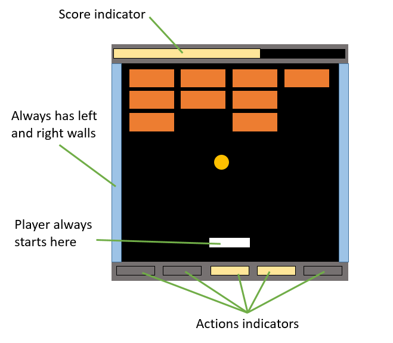


## List of Predefined Games

All games have an observation space of (84,84,3) with uint8 values in the range [0 to 255].

All games have an action space of Discrete(6) unless continuous actions are used (then it is Box(3, low=-1, high=1)).


| Image | Name | Description |
| :---: | :---: | :---: |
| 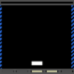 | Avalanche | Catch 50 falling blocks in a row. |
| 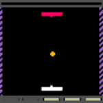 | Battle_Pong | Pong and bullets. |
| 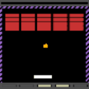 | Breakout | Break as many blocks as you can by bouncing the ball off the paddle. |
| 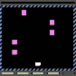 | Collect_Five | Collect all five blocks to win. |
| 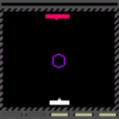 | Dodgeball_Duel | Shoot the enemy paddle, avoid the ball. |
| 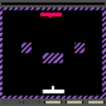 | Duel | Shoot the enemy paddle before it shoots you. |
| 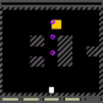 | Dungeon | Collect the treasure to win, avoid the bouncing balls. |
| 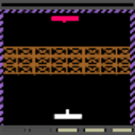 | Erosion | Shoot through the blockade and hit the enemy. |
| 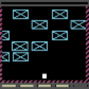 | Freeway | Navigate through traffic to reach the top of the screen. |
| 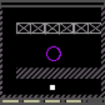 | Haunted_Hallway | Get to the other side without running into the ball. |
| 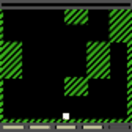 | Hedge_Maze | Navigate to the top of the screen. |
| 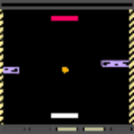 | Interference | Pong with moving blocks in the way. |
| 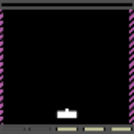 | Invasion | Eliminate 50 falling blocks to win. |
| 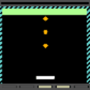 | Juggling | Get 10 hits on each ball to win. |
| 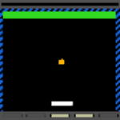 | Keep_Ups | Keep the ball in play for 20 consecutive hits. |
| 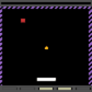 | Last_Block_On_The_Left | Hit the lone block to win. |
| 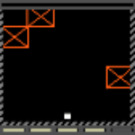 | Lava_Maze | Navigate to the top of the screen, but don't touch anything! |
| 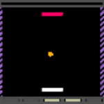 | Pong | Bounce the ball past the enemy paddle while keeping it from crossing your side of the screen. |
| 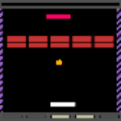 | Pong_Breakout | Pong with rows of blocks in the middle. |
| 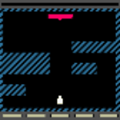 | Seek_Destroy | Navigate through obstacles and destroy the enemy. |
| 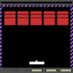 | Shootout | Break as many blocks as you can by shooting them. |
| 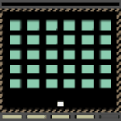 | Sweeper | Clear the playing area to win. |
| 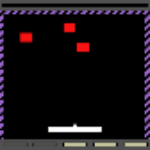 | Target_Practice | Hit 10 targets to win. |
| 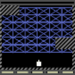 | Tunneler | Shoot your way through to the top of the screen. |


## Citing this Work
This work was published as a workshop paper at the NeurIPS 2021 Workshop on Deep Reinforcement Learning, and we ask that you cite the paper instead of this code repository. You can find a link to the paper <a href="https://openreview.net/forum?id=6Tw0QPDyXML" target="_blank">here</a>. Alternatively, you can just use the bibtex below:
```
@inproceedings{
staley2021meta,
title={Meta Arcade: A Configurable Environment Suite for Deep Reinforcement Learning and Meta-Learning},
author={Edward W Staley and Chace Ashcraft and Benjamin Stoler and Jared Markowitz and Gautam Vallabha and Christopher Ratto and Kapil Katyal},
booktitle={Deep RL Workshop NeurIPS 2021},
year={2021},
url={https://openreview.net/forum?id=6Tw0QPDyXML}
}
```


## Acknowledgements
Primary development of Meta Arcade was funded by the DARPA Lifelong Learning Machines (L2M) Program. Additionally, this work relates to Department of Navy award N00014-20-1-2239 issued by the Office of Naval Research. The United States Government has a royalty-free license throughout the world in all copyrightable material contained
herein.

©2021 The Johns Hopkins University Applied Physics Laboratory LLC
