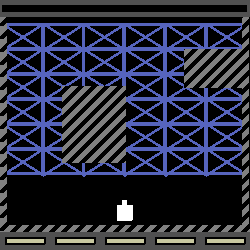
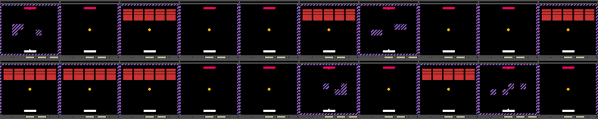

### Documentation Pages:

1. [Game Mechanics](./documentation/GameMechanics.md)

2. [Configuration Files](./documentation/ConfigurationFiles.md)

3. [Parameter Distributions](./documentation/ParameterDistributions.md)

4. [Building Curricula](./documentation/BuildingCurricula.md)

5. [Additional Tools](./documentation/AdditionalTools.md)

6. [Meta Arcade Inner Workings](./documentation/InnerWorkings.md)


Additional Tools and Utilities
===

This repository contains several additional tools that do not belong in the other documentation categories.  In no particular order:


### Human Agent

Any Meta Arcade game can be played with the keyboard by simply constructing the environment and passing it to ````human_agent()```` in human_agent.py:

```python
import gym
import meta_arcade
from meta_arcade.human_agent import human_agent

env = gym.make("MetaArcade-v0", config="pong")
human_agent(env) 
```

This is useful for testing a new game or simply getting familiar with the predefined games. When using this tool, make sure ***not*** to set ```headless=True```, and have the pygame window in focus to play the game.

The following keys are used for playing:

| Key             | Action     | Action Integer ID |
| --------------- | ---------- | ----------------- |
| Up Arrow Key    | Move Up    | 1                 |
| Down Arrow Key  | Move Down  | 2                 |
| Left Arrow Key  | Move Left  | 3                 |
| Right Arrow Key | Move Right | 4                 |
| Spacebar        | Shoot      | 5                 |

Additionally, the "R" key can be used to force-reset the game. If none of the above keys are pressed, a no-op (action 0) is taken.

Note that the game is slowed down so that a human can comfortably play.


### Random Agent

Another useful way to test games is to simply have them run with random actions. This is helpful for stepping through curricula or recording the performance of a random policy.  This is used similarly to ```human_agent```, but it does not look for keyboard input.

In  addition to the environment, the random agent accepts parameters about how long to run for (either in steps or episodes), and how long to delay each frame (in milliseconds) if you wish to slow the game down to analyze anything.

```python
import gym
import meta_arcade
from meta_arcade.random_agent import random_agent

env = gym.make("MetaArcade-v0", config="pong")
random_agent(env, episodes=100, steps=None, delay=0.02) 
```


### Creating GIFs of Gameplay

To help visualize performance (especially when running headlessly), a MetaArcade game can be asked to create a high-res GIF of each episode that is played. This severely slows down gameplay so it should only be used for evaluation. Additionally, the saved GIF is overwritten each episode as to avoid creating many large files.  To invoke this feature, pass the desired file path when building the environment:

````python
import gym
import meta_arcade
from meta_arcade.random_agent import random_agent

env = gym.make("MetaArcade-v0", config="tunneler", episode_as_gif_path="./path/to/my/animation.gif")

# run with some agent here to save GIF of latest episode
random_agent(env, episodes=1) 
````

This would produce something like:




### Visualizing Curricula

When altering visual element of games in curricula it can be helpful to visualize a single frame from each game in sequence. The ````get_first_frames```` utility uses a random agent to play through a curriculum randomly and record the first frame of each game. These frames are arranged into a grid and displayed with openCV, so that the grid image can copy/pasted or saved.  This utility was used to create the images in the Building Curricula documentation.

For example (from Building Curricula):

````python
# define pong, breakout, and duel
cfg_pong = make_config("pong")
cfg_breakout = make_config("breakout")
cfg_duel = make_config("duel")

# curriculum with task pooling
schedule = [
	# interpolate for 10 episodes
	[{"pool":[cfg_pong, cfg_breakout, cfg_duel]}, 20],			   
]

env, total_duration = meta_arcade.make_curriculum(schedule, episodic=True, headless=False)
meta_arcade.get_first_frames(env, episodes=total_duration, rows=2) #number of columns is inferred
````

This will display the following figure:

