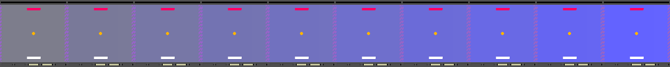
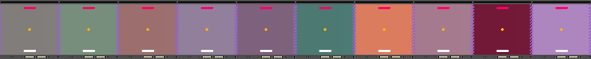
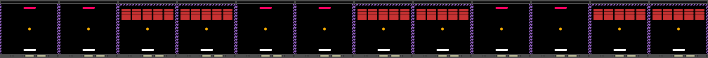

### Documentation Pages:

1. [Game Mechanics](./documentation/GameMechanics.md)

2. [Configuration Files](./documentation/ConfigurationFiles.md)

3. [Parameter Distributions](./documentation/ParameterDistributions.md)

4. [Building Curricula](./documentation/BuildingCurricula.md)

5. [Additional Tools](./documentation/AdditionalTools.md)

6. [Meta Arcade Inner Workings](./documentation/InnerWorkings.md)


Building Curricula
===

In addition to task-wise parameter variation, Meta Arcade contains utilities to compile multiple environments into curricula. This can be useful to create schedules of tasks for lifelong learning experiments, or pools of parallel tasks for multi-task and meta learning. The tools to create curricula are provided by the curriculum_tools package in the root directory. Note that all Meta Arcade games have identical observation spaces and action spaces which helps make this possible.


### Basic Curricula

The basic form of a curriculum is a list of environments, along with a duration for each to be used for. This can be specified in either steps or full episodes. The make_curriculum utility will wrap this schedule into a single gym environment, which iterates through scheduled tasks as it is interacted with.  For example:

```python
# create gym environments
pong = gym.make("MetaArcade-v0", config="pong")
breakout = gym.make("MetaArcade-v0", config="breakout")

# build a curriculum
schedule = [
	[pong, 20],
	[breakout, 20]			   
]

# compile into a single gym environment, and note the total curriculum duration
env, total_duration = meta_arcade.make_curriculum(schedule, episodic=True)
```

The above code creates a single environment object which tracks two Meta Arcade environments behind the scenes. Once pong has been played for 20 episodes, it will automatically switch over to breakout.  Since breakout is the last task in the curriculum, it will continue to play breakout indefinitely (the environment does not close itself at the end).

A similar curriculum can be constructed with steps as the unit of time:

```python
# create gym environments
pong = gym.make("MetaArcade-v0", config="pong")
breakout = gym.make("MetaArcade-v0", config="breakout")

# build a curriculum
schedule = [
	[pong, 5000],
	[breakout, 5000]			   
]

# compile into a single gym environment, and note the total curriculum duration
env, total_duration = meta_arcade.make_curriculum(schedule, episodic=False)
```

In this case, pong is played for 5000 steps before it is switched out for breakout. Note that the behavior is to force pong to terminate at a specific step by overriding its "done" value.  This is inconsequential when playing many episodes, but is important to remember in shorter curricula or testing curricula.  If this behavior is undesirable, consider using episodes as the basis for your curricula.

When using the ````make_curriculum```` function through meta_arcade, the environments do not need to be built ahead of time. Game names, JSON config files, or config dictionaries can be passed directly into the curriculum building function:

```python
# build a curriculum directly with config names
schedule = [
	["pong", 20],
	["breakout", 20]			   
]

# compile into a single gym environment, and note the total curriculum duration
# we can also pass environment kwargs here such as 'headless'
env, total_duration = meta_arcade.make_curriculum(schedule, episodic=True, headless=True)
```


### Advanced Curricula

In addition to sequential tasks, there are some specialized curricula entries that have additional capability. These are added with the following format:

```python
[{"key":<parameters>}, duration]
```

The environment is replaced with a dictionary having a single name (they key), and a corresponding value (parameters for this entry).

#### Meta Arcade Interpolation

Format: ````[{"interpolate":[config1, config2]}, duration]````

The ***interpolate*** key instructs the curriculum to interpolate between two similar game configurations over a set duration. The configurations must have similar entries and distribution settings. The configurations are interpolated on a episode-wise basis, so that values are constant over an episode but are re-computed on each reset() call.  For example:

```python
# define pong with gray background
cfg_pong = make_config("pong")
cfg_pong["display_settings"]["background_color"] = [128,128,128]

# pong with blue background
cfg_pong_blue = cfg_pong.copy()
cfg_pong_blue["display_settings"]["background_color"] = [100,100,255]

# curriculum
schedule = [
	# interpolate for 10 episodes with the interpolate key
	[{"interpolate":[cfg_pong, cfg_pong_blue]}, 10],			   
]

env, total_duration = meta_arcade.make_curriculum(schedule, episodic=True, headless=False)
meta_arcade.get_first_frames(env, episodes=total_duration, rows=1)
```

will result in the following episodes (first frame shown):




If distributions are specified instead of constants, the distribution parameters themselves will be interpolated. For example, a normal distribution may have its standard deviation altered over time:

```python
cfg_pong_1["display_settings"]["background_color"] = {"distribution":"normal", "mean":[128,128,128], "std":[0,0,0]}
# ... #
cfg_pong_2["display_settings"]["background_color"] = {"distribution":"normal", "mean":[128,128,128], "std":[60,60,60]}
# ... #
# make curriculum as before with these configs...
```

This would result in something like the following, with each episode having a greater variance in the background color distribution:




#### Task Pooling

Format: ````[{"pool":[config1, config2..., configN]}, duration]````

The ***pool*** key instructs the curriculum to maintain several environments and randomly choose among them at each reset() call. This is useful for learning several tasks at once or randomly sampling a subset of tasks.  For example:

```python
# define pong, breakout, and duel
cfg_pong = make_config("pong")
cfg_breakout = make_config("breakout")
cfg_duel = make_config("duel")

# curriculum with task pooling
schedule = [
	# interpolate for 10 episodes
	[{"pool":[cfg_pong, cfg_breakout, cfg_duel]}, 20],			   
]

env, total_duration = meta_arcade.make_curriculum(schedule, episodic=True, headless=False)
meta_arcade.get_first_frames(env, episodes=total_duration, rows=2)
```

will result in:


#### Sub-Curricula Repetition

Format: ````[{"repeat":sub_curriculum}, number_of_times_to_repeat]````

To aid with building large curricula that may interweave past experience, the ***repeat*** key specifies an entire sub-curriculum to be repeated a certain number of times. The format of the sub-curriculum is identical to a typical curriculum, and may include special keys as well.  The duration of this entry indicates the number of times to repeat the sequence. For example:

```python
# define pong and breakout
cfg_pong = make_config("pong")
cfg_breakout = make_config("breakout")

# define a sub-curriculum to repeat
repeat_block = [
	[cfg_pong, 2],
	[cfg_breakout, 2]
]

# repeat 3 times, for 12 episodes total
schedule = [
	[{"repeat":repeat_block}, 3],			   
]

# get schedule wrapped up in a single gym environment, and the total curriculum duration
# the total duration will be 12 to reflect the repeated portion
env, total_duration = meta_arcade.make_curriculum(schedule, episodic=True, headless=False)

# run the curriculum and display first frame of each episode afterwards
meta_arcade.get_first_frames(env, episodes=total_duration, rows=1)
```

will result in:




### Task ID Extraction

When maintaining a curriculum of many environments it is often necessary to query for an identifier of the current task. The curriculum_tools `NamedEnv` wrapper adds the ability to name an environment. This can be queried at any time with:

```python
env.unwrapped.name
```

You are free to use something other than a string to name the environment, such as a one-hot vector or some other identifying data.

For example:

```python
pong = gym.make("MetaArcade-v0", config="pong", headless=True)
pong = NamedEnv(pong, [1,0])
breakout = gym.make("MetaArcade-v0", config="breakout", headless=True)
breakout = NamedEnv(breakout, [0,1])

schedule = [
	[pong, 3],	
	[breakout, 3],			   
]
env, total_duration = meta_arcade.make_curriculum(schedule, episodic=True, headless=False)

for e in range(total_duration):

	# curriculum advances on reset()
    env.reset()

	# what task are we running now?
    print("Running task", env.unwrapped.name)

    # run the episode
    done = False
    while not done:
        a = env.action_space.sample()
        s, r, done, info = env.step(a)
```

Outputs:

```python
Running task [1, 0]
Running task [1, 0]
Running task [1, 0]
Running task [0, 1]
Running task [0, 1]
Running task [0, 1]
```


### Parallel Training Support

The logistics of using distributed training with curricula can be difficult to manage. Our recommended solution is to re-build the curriculum in each worker thread, and divide the durations of all curriculum entries by the number of workers. This can be done automatically with the ````across_workers```` option:

```python
schedule = [
	["pong", 500],
	["breakout", 500]			   
]

# curriculum for single thread
env, total_duration = meta_arcade.make_curriculum(schedule, 
	episodic=False, headless=True)

print(total_duration) # prints 1000

# curriculum for 4 workers in parallel
env, total_duration = meta_arcade.make_curriculum(schedule, 
	episodic=False, headless=True, across_workers=4)

print(total_duration) # prints 250
```

In the example above, the duration is specified as 1000 steps across 4 workers. The curriculum that is built will use 250 steps (125 for each task), and assumes that four total copies of the curriculum exist. If your workers are synchronized on a step-wise basis, this means that 1000 steps will be experienced overall (500 of each task, as specified in the curriculum).


### General-purpose Use

Curriculum_tools is provided as a separate package because it can be used generally with any gym environments, provided they are lightweight enough to be built ahead of time and stored in memory while not being used.  For extremely long curricula or heavyweight environments, it may be necessary to create custom wrappers or save/load routines such that the environments are only instantiated when actively in use.

The same principles above can be applied to general environments.  Here we construct a curriculum from OpenAI Gym Atari environments:

```python
ale_pong = gym.make("PongNoFrameskip-v4")
ale_breakout = gym.make("BreakoutNoFrameskip-v4")

schedule = [
	[ale_pong, 50000],
	[ale_breakout, 50000]			   
]

# Note we are using curriculum_tools.make_curriculum
env, total_duration = curriculum_tools.make_curriculum(schedule, episodic=False)

# action space is superset of all sub-environments:
print(ale_pong.action_space)		#prints Discrete(6)
print(ale_breakout.action_space)	#prints Discrete(4)
print(env.action_space)				#prints Discrete(6)
```

For additional information about the capabilities of the curriculum_tools package, please refer to the examples within the curriculum_tools directory.