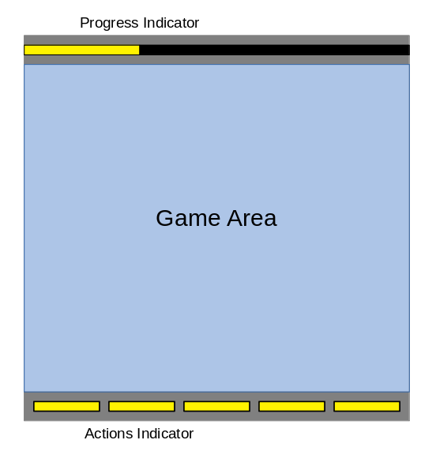
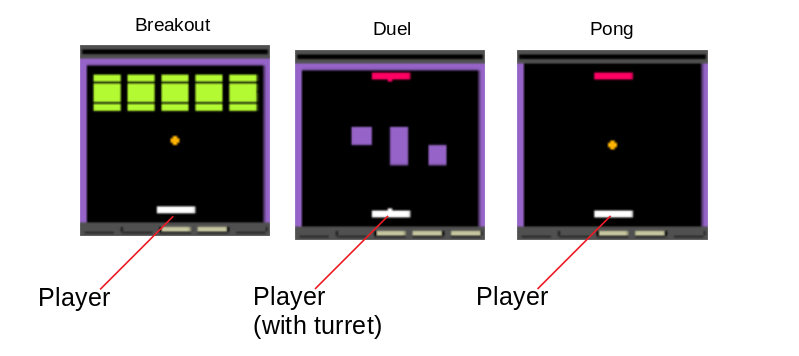
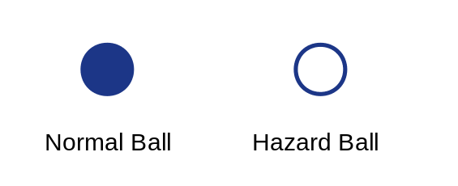
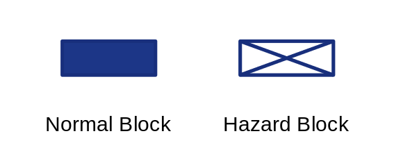

### Documentation Pages:

1. [Game Mechanics](./GameMechanics.md)

2. [Configuration Files](./ConfigurationFiles.md)

3. [Parameter Distributions](./ParameterDistributions.md)

4. [Building Curricula](./BuildingCurricula.md)

5. [Additional Tools](./AdditionalTools.md)

6. [Meta Arcade Inner Workings](./InnerWorkings.md)


Game Mechanics
===

Meta Arcade uses common game elements to construct all its games.  This is meant to enable the creation of multiple tasks (games) which have common visual features, reward components, and mechanics.  This document summarizes the primary game mechanics that are available in Meta Arcade.  For information about configuring specific elements, please see [Configuration Files](./documentation/ConfigurationFiles.md).

For a high-level description of using Meta Arcade, seen the main README.md at the top level of the repository.


## Gym Interface Spaces

The **observation space** of Meta Arcade is an 84x84 RGB color image (84x84x3), with values between 0 and 255, given as a numpy array with dtype uint8. This is taken from standard approaches to Atari games which downsize the color output to 84x84.

The pygame display shows the RGB game display at a higher resolution. Post-processing that is specified in the game configuration such as color inversion or color shifts will not be visible in the pygame window but will appear in the observation data.

The **action space** of Meta Arcade is 6 discrete actions corresponding to NO-OP, MOVE_UP, MOVE_DOWN, MOVE_LEFT, MOVE_RIGHT, SHOOT. Not all actions are available in all games- unused actions are mapped to NO_OP without changing the action space.

Continuous actions can be used instead for finer-grained control. In this case, three values [-1 to 1] are supplied corresponding to vertical movement, horizontal movement, and shooting. A shot is attempted if the third values is greater than zero. If a shot is attempted, the other values are overridden such that the player cannot move and shoot simultaneously.

The full options for building a Meta Arcade environment are provided as keyword arguments:

```python
env = gym.make("MetaArcade-v0", <kwargs here>)
```

Supported keywords are:

| Keyword               | Value                                                        | Default    | Description                                                  |
| --------------------- | ------------------------------------------------------------ | ---------- | ------------------------------------------------------------ |
| "config"              | game name (str), path to config json file (str), or MAConfig object | No default | Specifies the game to play.                                  |
| "headless"            | True / False                                                 | False      | Whether or not to show the pygame window. Setting to True provides a useful speed boost for training. |
| "episode_as_gif_path" | string or None                                               | None       | If a path is given, saves a high-res gif of the latest episode at the given location. Creates significant slowdown. |
| "game_ticks_per_step" | integer                                                      | 2          | How many inner game loops are run on each step().            |
| "continuous"          | True / False                                                 | False      | Optionally switch to a continuous action space.              |
| **kwargs              | additional kwargs, unused                                    | No default | If you want to extend Meta Arcade, this is a useful hook to supply additional options. |


## Game Display

The state space of any Meta Arcade game is a rendering of the game's display.  The game display consists of a main gameplay area in the center as well as a border than contains visual indicators about the game:



The visual indicator on the top is a progress bar that shows the current score from 0 to 100 points, which is the maximum score of any game. This is useful for game which have a progression, such as Breakout. The only negative scoring that is supported is penalties of -100.0, which instantly end the game. Therefore the total result of any game will fall between -100 and +100.

The visual indicators at the bottom consist of 5 areas which are either illuminated or not, showing which of the six actions is available for this game.  From left to right, these indicate 1:UP, 2:DOWN, 3:LEFT, 4:RIGHT, and 5:SHOOT.  A no-op action (0) is always available.


## Player

Actions in Meta Arcade always control the player, which is represented as a rectangle of some dimension (i.e. oblong for Pong, square for Freeway), which always starts centered at the bottom of the play area.



For games in which the player can shoot, the player has a small upward-facing turret in addition to the primary rectangle.  The player can shoot whenever it does not already have a live bullet in play.  This serves as both a limit on firing rate and a visual indicator of whether or not firing is possible.  The firing action (5) will be available either way, but will have no effect on the game if a Player's bullet is already active.

For games in which the player can move up or down, 100 points are rewarded (automatic win) for crossing the top of the game area, while -100 points (automatic loss) are rewarded for crossing the bottom of the game area.


## Ball

Many games include a ball that can bounce around the screen.  This leads to several mechanics that apply to all games:

 - Ball leaves top of screen: +100 points (win)
 - Ball leaves bottom of screen: -100 points (loss)
 - Ball hits static wall: bounces
 - Ball hits player from top: bounces

 Some of these may not apply to a given game, i.e. if the top or bottom of the game area is blocked off.

 The ball can also function as a hazard, in which case contact between the player and the ball results in -100 points (loss).  A hazardous ball is rendered differently than a normal ball.  The normal ball is a solid circle, while the harmful ball is just an outline.  Similar graphics are used for hazardous blocks (see below):




## Opponent Paddle

Some games include an enemy paddle that either deflects the ball back towards the player, shoots bullets towards the player, or both.  The opponent is locked to horizontal movement, and has logic to move toward a ball and away from bullets. This logic has added randomness so that it does not play perfectly, and the player always has a chance of winning.

Reward is only associated with the opponent when shooting is available, in which case:

- Enemy bullet hits player: -100 points (loss)
- Player hits opponent with bullet: +100 points (win)


## Blocks

Blocks are game elements that can either be collected or avoided, depending on the game. They are often instantiated in a grid, possibly with some sparsity. They also can move in one of three predefined ways:

- Static blocks: The blocks do not move
- Horizontal Wrap: Blocks move horizontally and "wrap around" after exiting the screen, reappearing on the opposite side. Block grids with multiple rows alternate direction each row.
- Vertical Wrap: Blocks fall vertically and "wrap around" to the top of the screen if they exit on the bottom.

Blocks have different behavior and different graphics depending on whether or not they are hazardous:




### Normal Blocks

- Player hits block: Reward, block is destroyed
- Normal ball hits block: Reward, block is destroyed, ball bounces
- Hazardous ball hits block: Ball bounces as though off a wall. Block is not destroyed.
- Player's Bullet hits block: Reward, block is destroyed
- Opponent's Bullet hits block: No Reward, block is destroyed
- Block falls past bottom of screen: -100 points (loss), or some other value if desired

The reward associated with collecting (destroying) a block is often a function of the total number of blocks. For example, in Breakout, the sum of all blocks should equal 100 points (win).  In other cases, blocks have no point value since collecting them is not the primary aim. A reward of -100.0 can be set to make blocks harmful without changing there appearance and behavior as described below.


### Hazardous Blocks

Hazardous blocks are not collectable.

- Player hits block: -100 points (loss)
- Normal ball hits block: Ball bounces as though off a wall. Block is not destroyed.
- Hazardous ball hits block: Ball bounces as though off a wall. Block is not destroyed.
- Player Bullet hits block: No Reward, block is destroyed
- Opponent Bullet hits block: No Reward, block is destroyed
- Block falls past bottom of screen: -100 points (loss), or some other value if desired


## Walls and Barriers

Barriers are the same color as walls and function the same way, namely:

- The player cannot move through barriers in any direction.
- The ball bounces of any barriers.
- Bullets are destroyed when they hit a barrier.

To avoid any visual confusion between a collectable block and and static barrier, walls and barrier are rendered with a striped texture.  The stripes are the same color as the background of the game area:


Barriers may be used to introduce non-hazardous, non-collectable obstacles to the game. For example, obstacles in Duel are use to provide shelter for both players.
