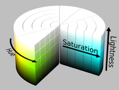

### Documentation Pages:

1. [Game Mechanics](./documentation/GameMechanics.md)

2. [Configuration Files](./documentation/ConfigurationFiles.md)

3. [Parameter Distributions](./documentation/ParameterDistributions.md)

4. [Building Curricula](./documentation/BuildingCurricula.md)

5. [Additional Tools](./documentation/AdditionalTools.md)

6. [Meta Arcade Inner Workings](./documentation/InnerWorkings.md)


Parameter Distributions
===

Game parameters described in [Configuration Files](./documentation/ConfigurationFiles.md) can optionally be expressed as distributions rather than constants. These distributions can be specified in a JSON config directly, or added programatically from with a python script.  Distributions are only sampled at the beginning of each episode such that all parameters within a single episode are constant.

There are three types of distributions that can be specified: Uniform, Normal / Gaussian, and Color.  All distributions are defined with the following syntax:

```
{"distribution":"name_of_distribution_type", "distribution_param_1":<value_1>, "distribution_param_2":<value_2>}
```


## Uniform Distributions

Uniform distributions specify a uniform range for a parameter to be sampled from at the beginning of each game. There are two values that must be specified: the "low" end of the range and the "high" end of the range.

**JSON Example:**

```json
"ball_settings":{
		"size": {"distribution":"uniform", "low":0.05, "high":0.10},
	}
```

This could be specified in python by reading in a config and assigning the same dictionary to a config field (JSON and python have the same dictionary syntax):

**Python Example:**

```python
cfg = meta_arcade.make_config("breakout")
cfg["ball_settings"]["size"] = {"distribution":"uniform", "low":0.05, "high":0.10}
env = gym.make("MetaArcade-v0", config=cfg)
```


Note that this also works with lists of values. In this case, a single value is sample between 0.0 and 1.0, and this value is used to interpolate all parameters in the list.  For example, to interpolate between a black background and a white background:

```json
"display_settings":{
		"background_color": {"distribution":"uniform", "low":[0,0,0], "high":[255,255,255]},
	}
```

The result will only sample grayscale values (r=g=b) since each channel uses the same random sampling to determine its value.


## Normal Distributions

Normal distributions specify a normally distributed range for a parameter around some mean value.  There are two values that must be specified: the "mean" of the range and the standard deviation ("std") of the range.  Note that the name of the distribution can be either "normal" or "gaussian", for convenience.

**JSON Example:**

```json
"ball_settings":{
		"size": {"distribution":"normal", "mean":0.1, "std":0.01},
	}
```

**WARNING**: There are no protections against invalid values.  The above specification is safe because the probability of sampling an invalid value (very small or negative ball size) is about zero.  However, if the standard deviation was very high, then invalid values could be sampled and the game would crash.  The only protection against this is sampling colors, which are clipped channel-wise to [0,255].  However, colors are more easily varied with the "color" distribution.


**Python Example:**

```python
cfg = meta_arcade.make_config("breakout")
cfg["ball_settings"]["size"] = {"distribution":"normal", "mean":0.1, "std":0.01}
env = gym.make("MetaArcade-v0", config=cfg)
```


Note that this also works with lists of values. In this case, each value in the list is treated as an independent normal distribution. The mean and standard deviation should be of the same size:

```json
"display_settings":{
		"background_color": {"distribution":"normal", "mean":[100,200,150], "std":[10,20,30]},
	}
```

The result will sample colors around [100,200,150] with a different deviation for each channel.


## Color Distributions

Color distributions are a special distribution to sample colors uniformly in HSL space. There is currently no support for gaussian sampling in HSL space, although this may be added in the future.

HSL space defines color in terms of three values [0.0 to 1.0], with hue being a circular value such that a hue of 0.0 is the same as 1.0.



Image Credit: https://commons.wikimedia.org/wiki/File:HSL_color_solid_cylinder_saturation_gray.png

Image License: https://creativecommons.org/licenses/by-sa/3.0/deed.en


This distribution takes three parameters:

- "hrange" : The bounds of acceptable hues as a list of two numbers. May use values outside of [0.0, 1.0] to wrap around hue values.  For example, "hrange":[0.9, 1.1] would sample uniformly around red (multiples of 1 correspond to red)

- "srange" : The bounds of acceptable saturations as a list of two numbers. 0.0 corresponds to grayscale while 1.0 corresponds to rich colors.

- "lrange" : The bounds of acceptable lightnesses as a list of two numbers. 0.0 corresponds to black, 0.5 corresponds to rich colors, and 1.0 corresponds to white.

  

**JSON Example:**

```json
"ball_settings":{
		"color": {"distribution":"color", "hrange":[-0.1, 0.2], "srange":[0.8, 0.9], "lrange":[0.6, 0.8]},
	}
```

**Python Example:**

```python
cfg = meta_arcade.make_config("breakout")
cfg["ball_settings"]["color"] = {"distribution":"color", "hrange":[-0.1, 0.2], "srange":[0.8, 0.9], "lrange":[0.6, 0.8]}
env = gym.make("MetaArcade-v0", config=cfg)
```


Note that any of the three parameters may be omitted to default to full range (0 to 1).  A distribution with no parameters will there select a random color from the entire spectrum, i.e. {"distribution":"color"}.

